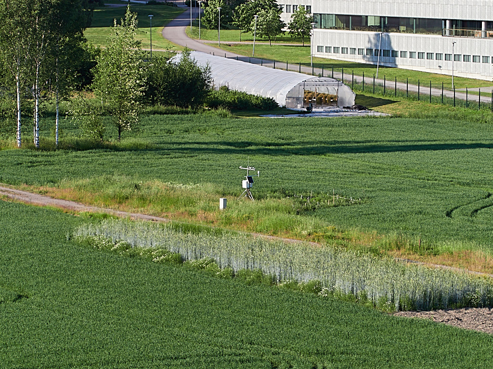
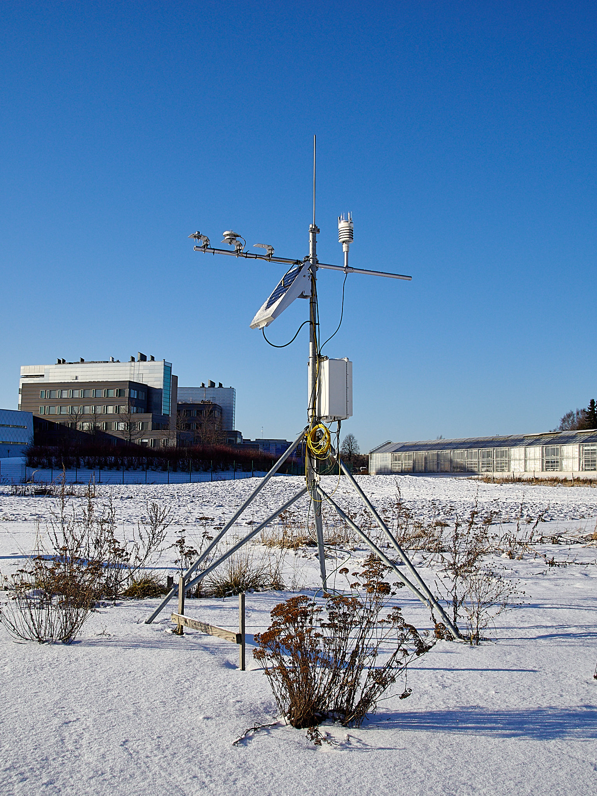
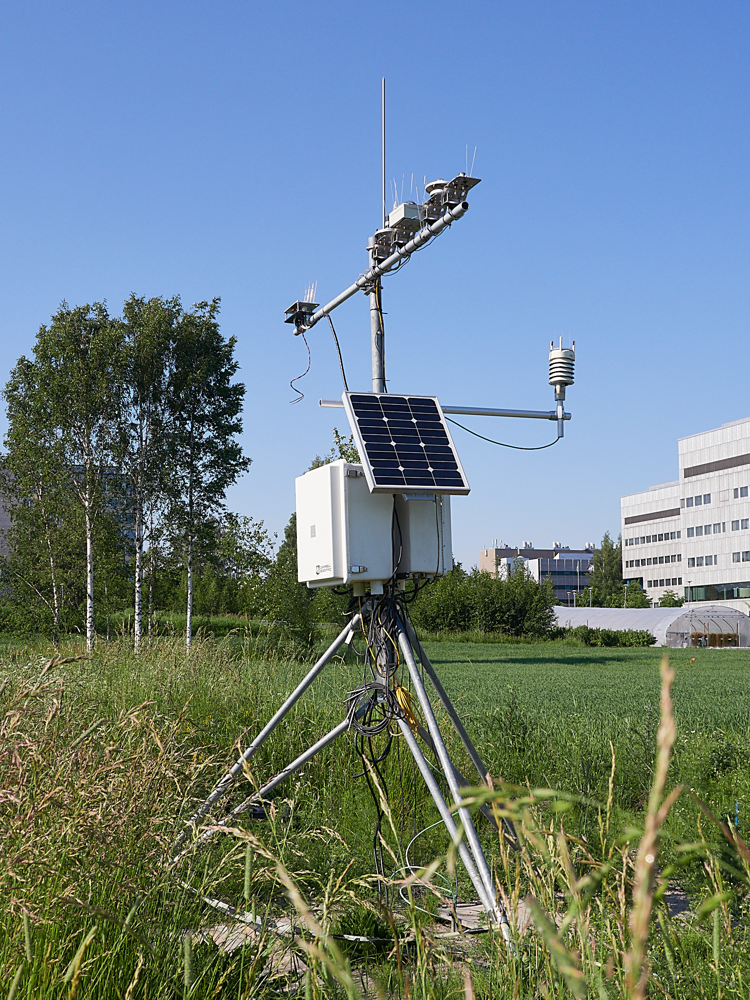
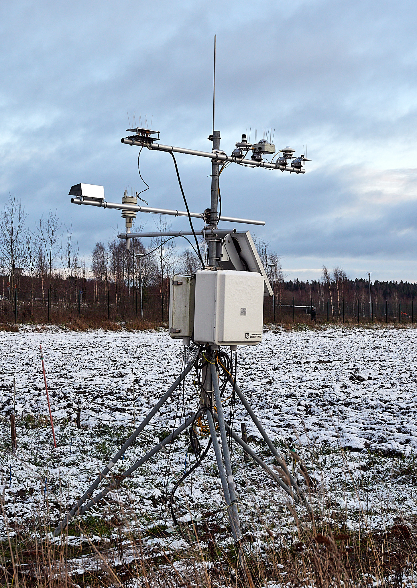
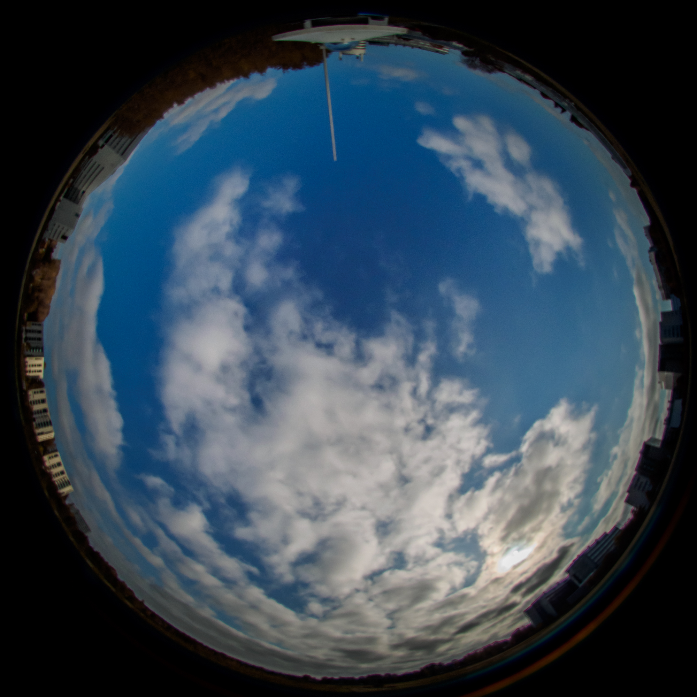
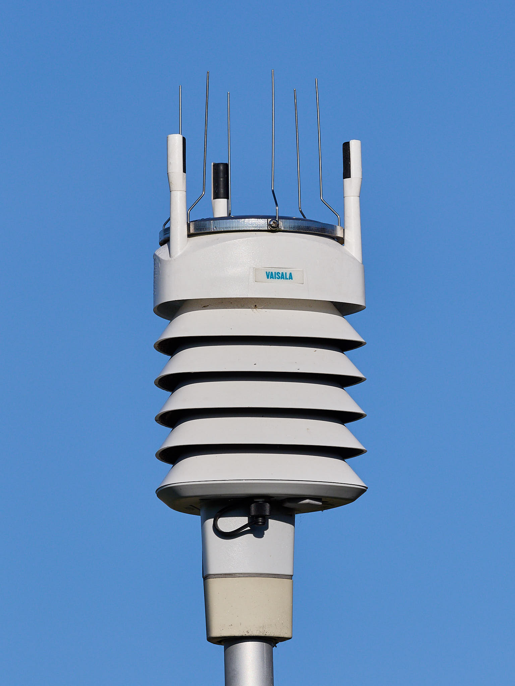
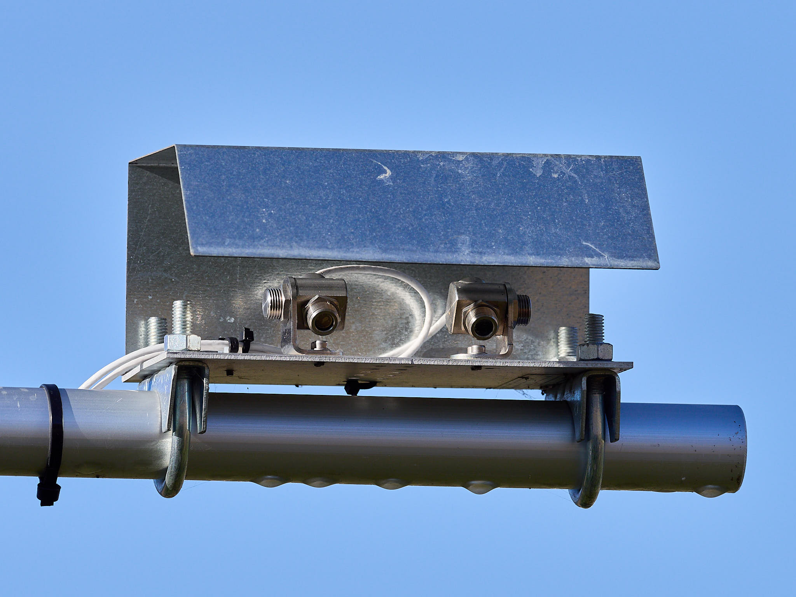

```{r setup, echo=FALSE}
knitr::opts_chunk$set(tidy = FALSE, cache = FALSE, echo = FALSE)
```

```{r, message=FALSE}
library(tidyverse)
library(ggridges)
library(lubridate)
```

## What makes this station different?

-   Time interval for acquisition of weather data: 5 s or 10 s.
-   Time interval for acquisition of soil data 1 h until April 2024, 12 min since then. 
-   Time interval for acquisition of sunlight data 5 s or 10 s until April 2024, 50 ms since then. 
-   Time interval for logging of summaries: 50 ms, 1 s, 1 min, 1 h, 1 d. 
-   Solar radiation measurement: currently seven different bands between UV-B to FR (NIR). In addition photosynthetically active radiation (PAR), total, direct and diffuse, and global radiation.
-   Soil measurements as a depth profile, ended in May 2025.
-   For research at the experimental field of the Viikki campus it provides on-site data.
-   Some of the radiation data are unique and of scientific interest in themselves.

## Location

The weather station is located in a reasearch field within the Viikki campus of
the University of Helsinki, in Helsinki, Finland. Although the location is open
enough, ensuring minimal disturbances to light measurements, some of the
nearby buildings can be expected to affect wind measurements. A view of the
weather station is shown in @fig-photo-birds-view.

Trees have been grown at the field, and until recently not near enough to disturb the measurements. These tress have been all fell. Birch sapplings have been recently planted near the weather station. In early 2025 they were about 1 m tall.

{#fig-photo-birds-view}

## Logger and data logging

A Campbell Scientific CR6 datalogger with a CDM-A116 analogue imput module is used. The datalogger has both digital and analogue inputs. The anologue to digital conversion (ADC) is done with 24 bits resolution and autoranging available. Data is acquired from most sensors once every 5 s and summaries computed and saved at 1 min-, 1 h-, and 1 d intervals. Soil sensors are read less frequently, and summaries saved at 1 h intervals. In the daily data, in addition to means, standard errors, maxima and minima for most variables, histograms for radiation data, computed in the logger, are also saved. In daily data, times for maxima and minima are also recorded. Each of the sets of summaries, 1 min, 1 h and 1 d, are stored in different *tables* (storage space) in the logger's CRBASIC program and downloaded as separate text files. A fourth table is used to store radiation data at the rate they are acquired. Data are downloaded on site through a USB connection to a laptop computer.

The station is powered by a battery that is charged by a mains power supply and a solar panel in parallel, ensuring uninterrupted power year-round in spite of the high frequency of measurements. The heating of some of the sensors during winter time is powered from mains by a separate power supply.

## Sensors and their deployment

{#fig-photo-winter-2017}

{#fig-photo-summer-2020}

{#fig-photo-winter-2020}

Radiation sensors are at $> 2\,$m above the ground surface, on a cross arm on the South of the tower, except for the sglux ones that are on the North side at the opposite end of the same cross arm. The weather sensor is at $1.9\,$m above the ground, at the East end of an East-West cross arm $0.75\,$m away from the mast. The sensors were relocated in the Spring of 2020, moving the radiation sensors higher up and the weather sensor from the North to the East side of the mast.
The sensors are arranged so that taller sensors are to the North of lower sensors, to minimize shading among them. In May 2025, the North-South cross arm was displaced towards the South to make space for additional sensors. The vertical position of the cross arm remained almost the same, 1-2 cm higher.

### Sensors 2016 to May 2025

| Sensor type      | make        | variable                  | qty. | signal | since-to    | time step | logging |
|:-----------------|:------------|:--------------------------|:-----|:-------|:--------------|:----------|:--------|
| UV-Cosine (UVB)  | sglux       | UVB irradiance            | 1    | 0-5V   | 2020/05       | 5 s       | rt, min, h |
| UV-Cosine (UVA)  | sglux       | UVA irradiance            | 1    | 0-5V   | 2020/05       | 5 s       | rt, min, h |
| UV-Cosine (blue) | sglux       | Blue-Violet irrad.        | 1    | 0-5V   | 2020/05       | 5 s       | rt, min, h |
| SKR-110 R/FR     | Skye        | red irradiance            | 1    | mV     | 2017/06       | 5 s       | rt, min, h |
| SKR-110 R/FR     | Skye        | far-red irradiance        | 1    | mV     | 2017/06       | 5 s       | rt, min, h |
| LI-190 quantum   | LI-COR      | PAR (total PPFD)          | 1    | mV     | 2016/01-2022/06 | 5 s       | min, h |
| CS310            | CampbellSci | PAR (total PPFD)          | 1    | mV     | 2021/06       | 5 s       | rt, min, h |
| SMP3 pyramometer | Kipp        | global radiation          | 1    | 0-1V   | 2016/01       | 5 s       | min, h |
| BF5              | Delta-T     | PAR (total PPFD)          | 1    | 0-2.5V | 2017/06       | 5 s       | rt, min, h |
| BF5              | Delta-T     | PAR (diffuse PPFD)        | 1    | 0-2.5V | 2017/06       | 5 s       | rt, min, h |
| WXT520           | Vaisala     | Air temperature           | 1    | SDI-12 | 2016/08-2021/06 | 5 s       | min, h |
| WXT520           | Vaisala     | Air humidity              | 1    | SDI-12 | 2016/08-2021/06 | 5 s       | min, h |
| WXT520           | Vaisala     | Wind speed                | 1    | SDI-12 | 2016/08-2021/06 | 5 s       | min, h |
| WXT520           | Vaisala     | Wind direction            | 1    | SDI-12 | 2016/08-2021/06 | 5 s       | min, h |
| WXT520           | Vaisala     | Atmospheric pressure      | 1    | SDI-12 | 2016/08-2021/06 | 5 s       | min, h |
| WXT520           | Vaisala     | Precipitation, rain       | 1    | SDI-12 | 2016/08-2021/06 | 5 s       | min, h |
| WXT520           | Vaisala     | Precipitation, hail       | 1    | SDI-12 | 2016/08-2021/06 | 5 s       | min, h |
| WXT536           | Vaisala     | Air temperature           | 1    | SDI-12 | 2021/06       | 10 s      | min, h |
| WXT536           | Vaisala     | Air humidity              | 1    | SDI-12 | 2021/06       | 10 s      | min, h |
| WXT536           | Vaisala     | Wind speed                | 1    | SDI-12 | 2021/06       | 10 s      | min, h |
| WXT536           | Vaisala     | Wind direction            | 1    | SDI-12 | 2021/06       | 10 s      | min, h |
| WXT536           | Vaisala     | Atmospheric pressure      | 1    | SDI-12 | 2021/06       | 10 s      | min, h |
| WXT536           | Vaisala     | Precipitation, rain       | 1    | SDI-12 | 2021/06       | 10 s      | min, h |
| WXT536           | Vaisala     | Precipitation, hail       | 1    | SDI-12 | 2021/06       | 10 s      | min, h |
| SoilVUE10        | CampbellSci | Soil moisture profile     | 3    | SDI-12 | 2020/05       | 12 min    | h      |
| SoilVUE10        | CampbellSci | Soil temperature profile  | 3    | SDI-12 | 2020/05       | 12 min    | h      |
| SoilVUE10        | CampbellSci | Soil elect. cond. profile | 3    | SDI-12 | 2020/05       | 12 min    | h      |
| SoilVUE10        | CampbellSci | Soil permittivity profile | 3    | SDI-12 | 2020/05       | 12 min    | h      |
| CS655            | CampbellSci | Soil moisture             | 3    | SDI-12 |               | 12 min    | h      |
| CS655            | CampbellSci | Soil temperature          | 3    | SDI-12 |               | 12 min    | h      |
| CS655            | CampbellSci | Soil elect. cond.         | 3    | SDI-12 |               | 12 min    | h      |
| CS655            | CampbellSci | Soil permittivity         | 3    | SDI-12 |               | 12 min    | h      |
| 107              | CampbellSci | Soil temperature profile  | 4    | ohms   | 2020/08       | 5 s       | min, h |
| CSmicro LT02     | Optris      | Surface temperature       | 2    | 0-5V   | 2020/11       | 5 s       | min, h |

: Sensors installed in the weather station and when they have been operative between 2015 and May 2025. Column, *signal* shows how the datalogger receives the information. Sensors with mV (millivolt) output lack built-in amplifier and provide a raw electrical signal. Sensors with V (Volt) output have a built-in analogue amplifier. Signal in ohms ($\Omega$) is the sensor's electrical resistance. SDI-12 is a digital serial communication protocol. In the case of analogue sensors, the digital conversion is done by the datalogger. For digital signals the conversion is done in the sensor. Most SDI-12 "sensors" like the WXT520 and WXT536 "weather transmitters" contain sensors for multiple variables. SDI-12 communication allows the data from difference sensors to be sent sequentially using the same wires and logger inputs. Column *since-to* gives the period when sensors have been operative. Column *time step* refers to data acquisition, while column *logging* refers to the time step for data storage, encoded as: *rt* = real time or same as data acquisition; *min* indicates logging of the summaries of acquired data once per minute and *h* once per hour. When data are logged once per minute, hourly averages are in some cases computed off-line in post processing from the 1-min averages. For radiation data, daily histograms were also logged until 2024-04-22. {#tbl-sensors}

### Sensors since May 2025

| Sensor type      | make        | variable                  | qty. | signal | since-to      | time step | logging |
|:-----------------|:------------|:--------------------------|:-----|:-------|:--------------|:----------|:--------|
| UV-Cosine (UVB)  | sglux       | UVB irradiance            | 1    | 0-5V   | 2020/05       | 50 ms     | 1 s |
| UV-Cosine (UVA)  | sglux       | UVA2 irradiance           | 1    | 0-5V   | 2020/05       | 50 ms     | 1 s |
| UV-Cosine (UVA1) | sglux       | UVA1 irradiance           | 1    | 0-5V   | 2025/05       | 50 ms     | 1 s |
| Blue-Cosine      | sglux       | Blue irradiance           | 1    | 0-5V   | 2025/05       | 50 ms     | 1 s |
| Green-Cosine     | sglux       | Green irradiance          | 1    | 0-5V   | 2025/05       | 50 ms     | -   |
| UV-Cosine (UVB)* | sglux       | UVB irradiance            | 1    | 0-5V   | 2025/05       | 50 ms     | 50 ms |
| UV-Cosine (UVA)* | sglux       | UVA2 irradiance           | 1    | 0-5V   | 2025/05       | 50 ms     | 50 ms |
| UV-Cosine (UVA1)*| sglux       | UVA1 irradiance           | 1    | 0-5V   | 2025/05       | 50 ms     | 50 ms |
| Blue-Cosine*     | sglux       | Blue irradiance           | 1    | 0-5V   | 2025/05       | 50 ms     | 50 ms |
| Green-Cosine*    | sglux       | Green irradiance          | 1    | 0-5V   | 2025/05       | 50 ms     | 50 ms |
| S2-131-SS R/FR   | Apogee      | red irradiance            | 1    | mV     | 2025/05       | 50 ms     | 50 ms |
| S2-131-SS R/FR   | Apogee      | far-red irradiance        | 1    | mV     | 2017/06       | 50 ms     | 50 ms |
| CS310            | CampbellSci | PAR (total PPFD)          | 1    | mV     | 2021/06       | 50 ms     | 50 ms, 1 s |
| BF5              | Delta-T     | PAR (total PPFD)          | 1    | 0-2.5V | 2017/06       | 50 ms     | 1 s |
| BF5              | Delta-T     | PAR (diffuse PPFD)        | 1    | 0-2.5V | 2017/06       | 50 ms     | 1 s |
| SMP3 pyramometer | Kipp        | global radiation          | 1    | 0-1V   | 2016/01       | 50 ms     | 1 s |
| CSmicro LT02     | Optris      | Surface temperature       | 2    | 0-5V   | 2020/11       | 50 ms     | 1 s |
|:-----------------|:------------|:--------------------------|:-----|:-------|:--------------|:----------|:--------|
| WXT536           | Vaisala     | Air temperature           | 1    | SDI-12 | 2021/06       | 10 s      | 1 min |
| WXT536           | Vaisala     | Air humidity              | 1    | SDI-12 | 2021/06       | 10 s      | 1 min |
| WXT536           | Vaisala     | Wind speed                | 1    | SDI-12 | 2021/06       | 10 s      | 1 min |
| WXT536           | Vaisala     | Wind direction            | 1    | SDI-12 | 2021/06       | 10 s      | 1 min |
| WXT536           | Vaisala     | Atmospheric pressure      | 1    | SDI-12 | 2021/06       | 10 s      | 1 min |
| WXT536           | Vaisala     | Precipitation, rain       | 1    | SDI-12 | 2021/06       | 10 s      | 1 min |
| WXT536           | Vaisala     | Precipitation, hail       | 1    | SDI-12 | 2021/06       | 10 s      | 1 min |

: Sensors in use at the weather station since May 2025, and since when they have been in use. Column, *signal* shows how the datalogger receives the information. Sensors with mV (millivolt) output lack built-in amplifier and provide a raw electrical signal. Sensors with V (Volt) output have a built-in analogue amplifier. SDI-12 is a digital serial communication protocol. In the case of analogue sensors, the digital conversion is done by the datalogger. For digital signals the conversion is done in the sensor. Most SDI-12 "sensors" like the WXT536 "weather transmitters" contain sensors for multiple variables. SDI-12 communication allows the data from difference sensors to be sent sequentially using the same wires and logger inputs. Column *since-to* gives the period when sensors have been operative. Column *time step* refers to data acquisition, while column *logging* refers to the time step for data storage, actual readings or when slower, averages. {#tbl-sensors}

The response time constants differ among sensors. According to manufacturers' specifications the time constants of the radiation sensors currently in use are as follows. The sensors for UVB, UVA and blue have a time constant of $150\pm25$ ms. The _Campbell CS310/Apogee SQ-500-SS_ PAR sensor has a time constant $<1$ ms. The Kipp pyranometer has a time constant of $\approx12$ s. The Delta-T BF5 sensor has a time constant $< 250$ ms. The Skye R+FR sensor has a time constant of $\approx 10$ ns (?!). The WXT356 weather transmitter has different time constants for different variables for the values used to compute in-sensor summaries, while to fastest supported polling by the logger to retrieve data is once every $10$ s.

{#fig-photo-fisheye}

As seen in the photograph above, the true horizon is not visible in all directions. A small grove of birch trees about 100 m to the North of the station were cut in year 2020 while a group of aspens some 300 m to the South were cut at the end of the summer of 2023. The birch trees may have affected the wind regime to some extent from start of measurements in 2015 until the Summer of 2020. In spite of the distance of several hundred meters to them, the tall buildings around the field are likely to disturb wind direction and speed differently in different parts of the field. The buildings occlude the solar disk for very low sun elevation angles but only for some azimuth angles. Anyway, nearly the whole sky is visible to the radiation sensors and the solar disk is occluded by obstacles only vary rarely, delaying "sunrise" and anticipating "sunset" by only a few minutes, causing a discontinuity in the daily course of irradiance, clearly visible at longer wavelengths. 

{#fig-photo-wtx}

 pyranometer from Kipp (right)"){#fig-photo-sensors-LI-Kipp}

 red and far-red sensor from Skye Instruments (right)"){#fig-photo-sensors-Delta-T-Skye}

 Campbell Scientitfic/Apogee PAR sensor (right)"){#fig-photo-sensors-sglux}

{#fig-photo-sensors-optris}

# Equipment suppliers

[Campbell Scientific](https://www.campbellsci.com/)

[Delta-T Devices](https://www.delta-t.co.uk/)

[Kipp & zonen](https://www.kippzonen.com/)

[Optris](https://www.optris.de/)

[sglux](https://sglux.de/)

[Skye Instruments](https://www.skyeinstruments.com/)

[Vaisala](https://www.vaisala.com/en)
